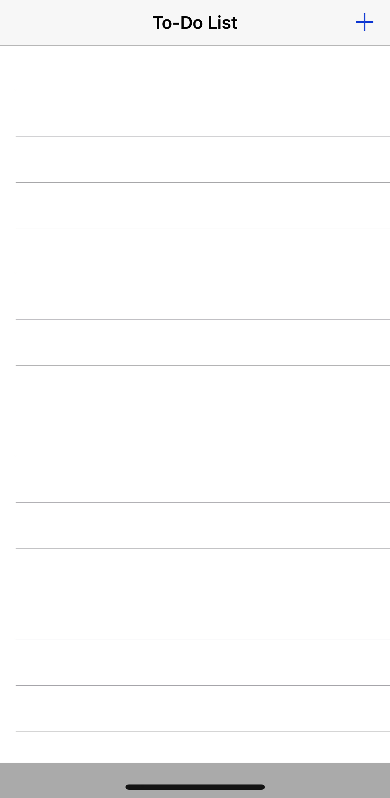
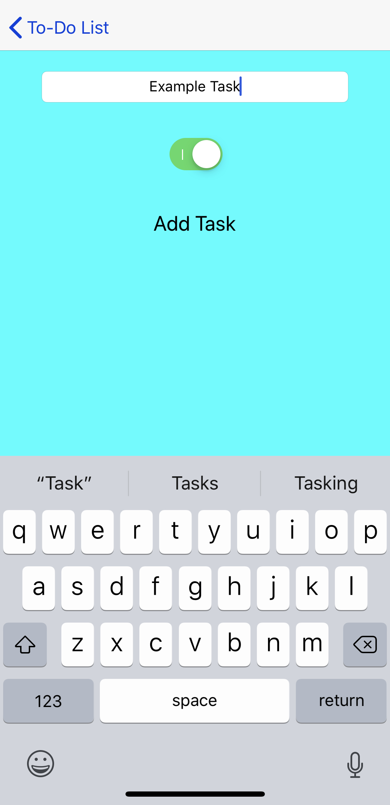
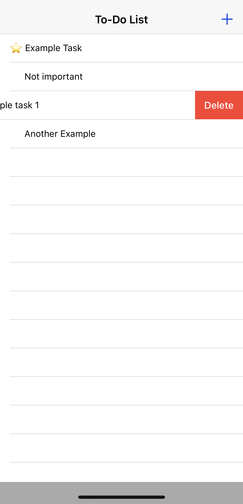

# To Do List
A simple To-Do list application for **iOS** made in **Swift**.

## How to use
When you first open the app you will be greeted with an empty task list:

To **add a task**, simply click on the + button in the *top right corner*, then add a **name** to your task, use the *switch* to indicate if it is **urgent**, then click **add task** on the following screen:

Once a few tasks are added, you will see that they are added to your list of tasks to complete. A :star: emoji indicates that the task is **important**, while the absence of a :star: means that the task can wait. Once a task is **complete**, simply swipe left on the task to **delete** it from your list!

